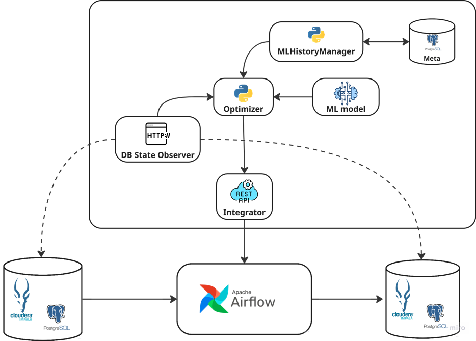
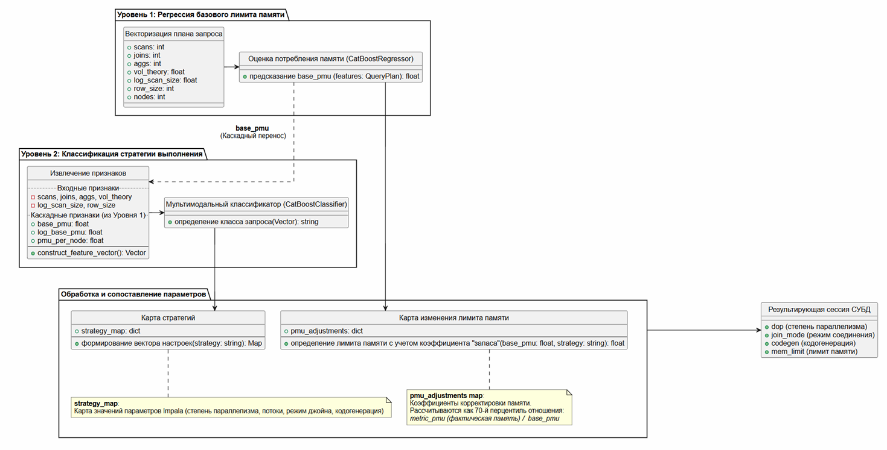
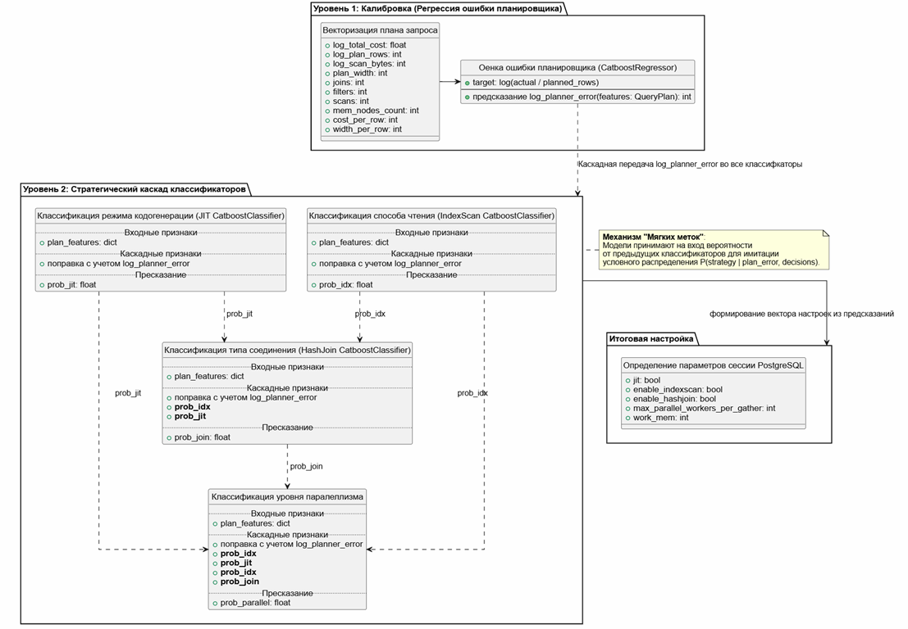
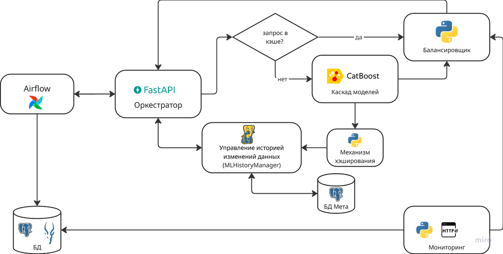

# MLoptETL

## Тема: Разработка системы адаптивного управления параметрами выполнения запросов в процессах оркестрации данных

## Цель исследования: 
Сокращение времени настройки ETL-процессов в конвейерах оркестрации для контроля выполнения SQL-запросов и регуляции ресурсопотребления в гетерогенных информационных средах.

## Задачи исследования:
1. Исследование подходов автоматизации настройки ETL-процессов: формализация факторов влияния на производительность ETL-загрузок (параметры плана выполнения, метрики текущего состояния инфраструктуры, исторические логи) и определение методов их адаптивного конфигурирования
2. Исследование ML-алгоритмов определения параметров загрузки: разработка методов векторизации запросов (создание алгоритма преобразования структурных данных плана запроса и мониторинга состояния системы в числовой вектор признаков для обучения моделей машинного обучения) и выбор алгоритма ML для предсказания динамического изменения параметров загрузки с целью адаптации к текущему состоянию инфраструктуры и изменениям данных;
3. Реализация архитектуры гибридной системы обратной связи на базе оркестратора Airflow: разработка операторов и классов подключения к различными СУБД, реализующие «цикл самонастройки»;
4. Проведение экспериментальных исследований.

## Краткая характеристика результатов:

Разработан метод автоматизированного подбора параметров сессий СУБД на основе векторизации планов SQL-запросов и ансамбля моделей градиентного бустинга CatBoost. Архитектура модуля применения моделей включает механизмы мониторинга состояния кластера для динамической коррекции предсказания ML-алгоритма с целью адаптации к текущей нагрузке на систему. Реализация модуля в виде специализированного микросервиса позволила обеспечить бесшовную интеграцию в конвейеры обработки данных системы оркестрации Apache Airflow, что сократило время настройки ETL-задач выполнения запросов с минут до миллисекунд. Решение обеспечивает стабильность процессов миграции данных в гетерогенных информационных средах, оптимизирует утилизацию ресурсов кластера и позволяет масштабировать обработку данных без кратного роста эксплуатационных затрат.

## Структура проекта:
| Описание                                                       | Ссылка                                                                                                                                                                                                                                                                            |
|:---------------------------------------------------------------|:----------------------------------------------------------------------------------------------------------------------------------------------------------------------------------------------------------------------------------------------------------------------------------|
| Реализация экспертной системы формирования обучающего датасета | https://github.com/OlgaVit15/MLoptETL/tree/dev/model_service/education/dataset_pipeline                                                                                                                                                                                           |
| Реализация обучения и оценки предсказания каскада моделей      | Для Impala: https://github.com/OlgaVit15/MLoptETL/tree/dev/model_service/query_optimizer/services/impala_service/models/model_predict  Для PostgreSQL: https://github.com/OlgaVit15/MLoptETL/tree/dev/model_service/query_optimizer/services/posgres_service/models/model_predict |
| Реализация API ML-модуля                                       | https://github.com/OlgaVit15/MLoptETL/tree/dev/model_service/query_optimizer                                                                                                                                                                                                      |
| Реализация хэширования запросов для оптимизации инференса      | https://github.com/OlgaVit15/MLoptETL/blob/dev/model_service/query_optimizer/common/hasher.py                                                                                                                                                                                     |
| Реализация оператора Airflow                                   | MLoptETL/tree/dev/airflow/airflow-local-etl/dags/common                                                                                                                                                                                                                           |

## Схема технологического решения:

## Архитектура применения моделей:

### Impala

### PostgreSQL

## Схема процесса обработки запроса:

## Тестирование разработки:

### Оценка качества предсказания:

#### Impala

*Лимит памяти (mem_limit):* 𝑹^𝟐 = 0.86 MAE = 14.96 MB

#### PostgreSQL
*Ошибка планировщика (log_planner_error):* 𝑹^𝟐 = 0.93 MAE = 0.173

### Оценка производительности:

#### API Impala

#### API PostgreSQL 

